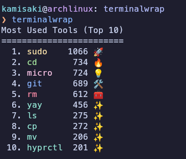

<div align="center">

# TerminalWrap
🧑‍💻 Which command do you use the most in the terminal? Let's find out the fun way!

<h3>
Terminal usage analytics tool written in <code>Go</code>
</h3>
<br>




<br>
⭐️ **If you like this project, please consider starring the repo!** ⭐️

</div>

---

## 💫 Features

- **Supports all popular shells:**
  - Bash
  - Zsh
  - Fish

- **Lists your most used terminal tools and commands**
- **Colorful and emoji-rich output**
- **Motivational and fun summaries**
- **Automatic shell detection or manual selection**

---

## 💻 Installation

### 1. Arch Linux (AUR)

You can easily install TerminalWrap via [AUR](https://aur.archlinux.org/packages/terminalwrap):

```bash
yay -S terminalwrap
```

### 2. Manual Build (Any Linux)

1. **Clone the repository:**
    ```bash
    git clone https://github.com/xeyossr/terminalwrap.git
    cd terminalwrap
    ```

2. **Install Go if you don't have it:**
    ```bash
    # Debian/Ubuntu
    sudo apt install golang

    # Arch
    sudo pacman -S go
    ```

3. **Build and install:**
    ```bash
    make
    sudo make install
    ```

---

## 🚀 Usage

```bash
terminalwrap [OPTIONS]
```

**Options:**
- `--bash`  Force using Bash history
- `--zsh`  Force using Zsh history
- `--fish`  Force using Fish history
- `--top N` Show top N tools (default: 10)
- `--help`  Show help message

If no shell is specified, TerminalWrap will auto-detect your current shell.

---

## 🐚 Supported Shells

- Bash
- Zsh
- Fish

Want to see support for another shell?  
**Feel free to [contribute](#contributing) and add support for your favorite shell!**

---

## 🤝 Contributing

Contributions, issues and feature requests are welcome!  
If you'd like to add support for a new shell or improve the project, please open a pull request or issue.

See [CONTRIBUTING.md](CONTRIBUTING.md) for guidelines.

---

## 📄 License

This project is licensed under the GNU General Public License v3.0.  
See the [LICENSE](LICENSE) file for details.

---

## 🙏 Credits & Inspiration

- Inspired by [islemci/cliwrap](https://github.com/islemci/cliwrap)

---
